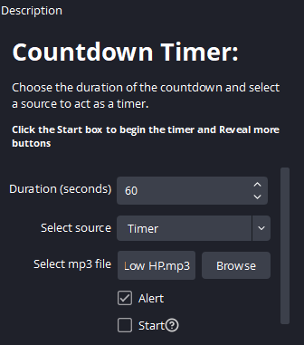
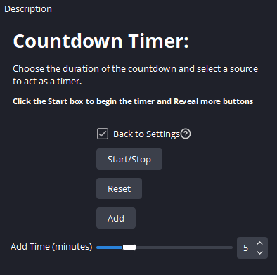

# OBS Python Countdown Timer
OBS script which allows you to turn a text source into countdown timer.
You can set the duration of the timer, the source it uses, and you can set an mp3 file which can be triggered alongside a flashing alert when the timer is below 60 seconds. This feature can be toggled on or off.

# How To Use
To use this timer, you must add the "Timer.py" file to your obs "Scripts" tab which can be found under "Tool".

- First you must input the duration of the timer in seconds (i.e. if you wanted the timer to run for an hour you input 3600)
- Set the source which the timer will use. If there is no options you will have to create a text source.
- You can then set the song (.mp3 file) you want to play alongside the alert. Within the download folder though is a default song (The  "Low Hp" theme from Pokemon Black and White) which you can also use without selecting anything.
- There is also a check mark box titled "Alert". Check this to allow the 60 seconds left alert to play. This results in the timer moving to the middle of the screen for 5 seconds while flashing between the default colour and red with the song playing until the timer finishes or the timer's duration is added to.

## Once you set all the settings you can select the "Start" check box. 
Selecting this will hide all the settings and reveal buttons which you can use to control the Timer, as well as a slider in which you can use to change the amount of time you can add to duration left.

# Streaming Integration
This script also has the ability for viewers to add to the timer under certain conditions, i.e. Channel Points. However, this requires external software such as "MixItUp", which allows you to create custom channel point rewards, or interactions based on subscriptions, or donations.
